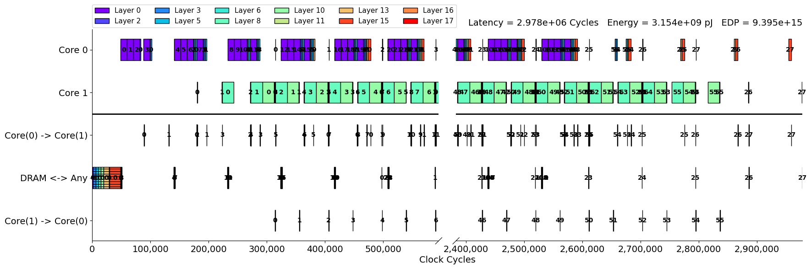

# Cyclic Scheduling of Stream

A custom fitness evaluation for Stream to perform row-wise (or close to row-wise) Layer-Fusion scheduling in Stream.
This library explots the very symmetric properties of row-wise layer fusion to speeed up analysis time and explore further schedulings.  
The drawback of this techniquer is a small loss at the prologue and the epilogue in terms of latency.

## NOTE
This library uses a custom version of Stream that allows custom fitness evaluation at [stream-fork](https://github.com/Andful/stream-fork/tree/draft-custom-fitness-evaluation)
